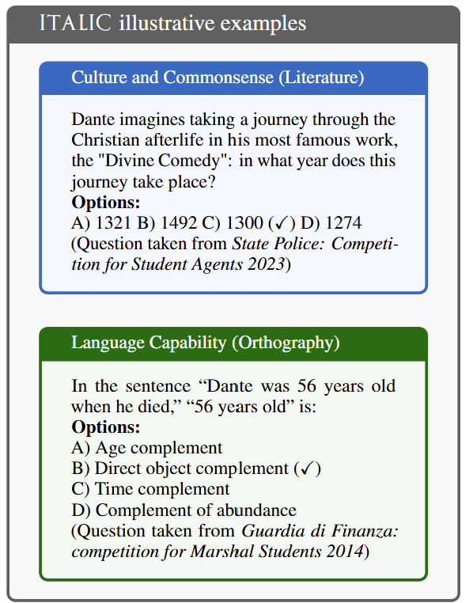
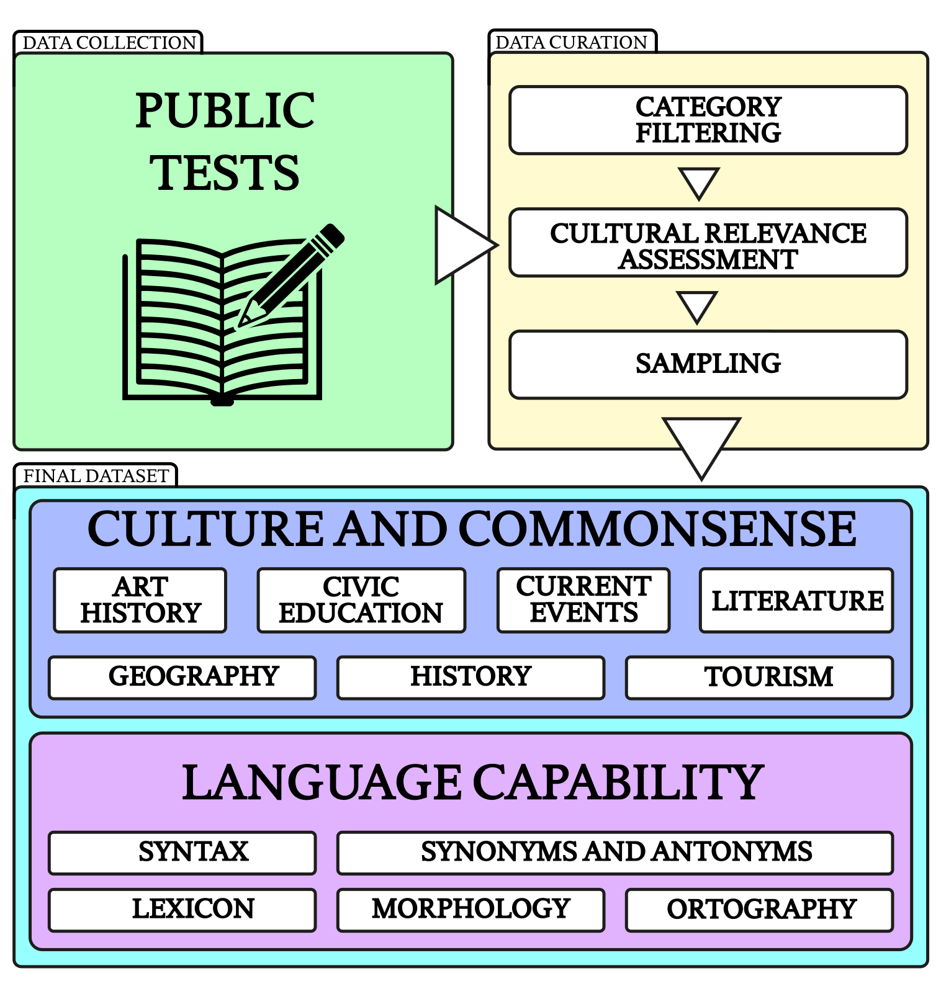

# Dataset Card for ITALIC

<!-- Provide a quick summary of the dataset. -->

ITALIC is a benchmark evaluating language models' understanding of Italian culture, commonsense reasoning and linguistic proficiency in a morphologically rich language.

<p align="center">
  
</p>

Above are example questions from *ITALIC*. **Note**: every example is a direct translation; the original questions
are in Italian. The correct option is marked by (✓).

## Dataset Details

### Dataset Description

<!-- Provide a longer summary of what this dataset is. -->

We present *ITALIC*, a large-scale benchmark dataset of 10,000 multiple-choice questions designed to evaluate the natural language understanding of the Italian language and culture. 
*ITALIC* spans 12 domains, exploiting public tests to score domain experts in real-world scenarios. 
We detail our data collection process, stratification techniques, and selection strategies. 

*ITALIC* provides a comprehensive assessment suite that captures commonsense reasoning and linguistic proficiency in a morphologically rich language. 
It serves as a benchmark for evaluating existing models and as a roadmap for future research, encouraging the development of more sophisticated and culturally aware natural language systems.

- **Curated by:** CRISP research centre https://crispresearch.it/
- **Language(s) (NLP):** Italian
- **License:** MIT


### Dataset Sources

<!-- Provide the basic links for the dataset. -->

- **Huggingface:** https://huggingface.co/datasets/Crisp-Unimib/ITALIC
- **Zenodo** [ADD THIS LATER]
- **Paper:** [ACCEPTED AT NAACL25]

## Dataset Structure

<!-- This section provides a description of the dataset fields, and additional information about the dataset structure such as criteria used to create the splits, relationships between data points, etc. -->
*ITALIC* contains 10,000 carefully curated questions selected from an initial corpus of 2,110,643 questions. 

Each question is formatted as a multiple-choice query, with an average question length of 87 characters and a median of 4 answer options.
The longest question is 577 characters long. The minimum number of choices per question is 2, while the maximum is 5. 
The total number of tokens across the input data amounts to 499,963.

| Column                 | Data Type     | Description                                                                 |
| ---------------------- | ------------- | --------------------------------------------------------------------------- |
| `question` | [String]   | The actual content of the question |
| `options` | [List]   | The options to choose from. Only one is correct |
| `answer` | [String]   | The correct answer out of the options |
| `category` | [String]   | The dedicated cultural section of the question |

## Dataset Creation

### Curation Rationale

<!-- Motivation for the creation of this dataset. -->

The corpus comprises questions and tasks from real-world exams, professional assessments, and domain-specific challenges.
Given that the data originates from institutional sources, it is expected to maintain a high standard of quality and accuracy, as domain experts crafted it for public evaluations. 

### Source Data

<!-- This section describes the source data (e.g. news text and headlines, social media posts, translated sentences, ...). -->

#### Data Collection and Processing

<!-- This section describes the data collection and processing process such as data selection criteria, filtering and normalization methods, tools and libraries used, etc. -->
The initial data was sourced from various files in PDF, HTML, DOC, and other formats published by official bodies that announce individual competitive public examinations.

Please consult the full paper for a detailed description of our curation process.

<center></center>

#### Who are the source data producers?

<!-- This section describes the people or systems who originally created the data. It should also include self-reported demographic or identity information for the source data creators if this information is available. -->
The dataset includes tests for admission to the Carabinieri, Penitentiary Police, Italian Army, State Police, Forestry Corps, Firefighters, Air Force, Navy, Guardia di Finanza, Italian ministries, teachers of the Italian school system of all levels, principals of the Italian school system of all levels, nurses of the national health system, and managers of the public administration from 2008 to 2024 available freely on the website of each institutional body.

#### Personal and Sensitive Information

<!-- State whether the dataset contains data that might be considered personal, sensitive, or private (e.g., data that reveals addresses, uniquely identifiable names or aliases, racial or ethnic origins, sexual orientations, religious beliefs, political opinions, financial or health data, etc.). If efforts were made to anonymize the data, describe the anonymization process. -->

The dataset does not contain confidential information. 
It is also free from content that could be considered offensive, insulting, threatening, or distressing. Since it solely comprises data from standardised tests and does not involve human subjects or personal data, an ethical review process was not required.

## Bias, Risks, and Limitations

<!-- This section is meant to convey both technical and sociotechnical limitations. -->
Potential risks of misuse include using the benchmark results to justify or argue against the need to develop native LLMs specifically tailored for the Italian language.
This possibility should be considered to avoid misinterpretations or unintended consequences when leveraging the evaluation outcomes.

### Maintenance

*ITALIC* is designed to be robust and fully operational upon release, with no need for routine maintenance. However, as language and cultural norms evolve, periodic updates will be required to ensure the benchmark remains relevant. A new dataset version will be created and made available in such cases.

## Citation

<!-- If there is a paper or blog post introducing the dataset, the APA and Bibtex information for that should go in this section. -->

**BibTeX:**

```
[COMING SOON]
```

**APA:**

[COMING SOON]


## Dataset Card Contact

Andrea Seveso - andrea.seveso@unimib.it
